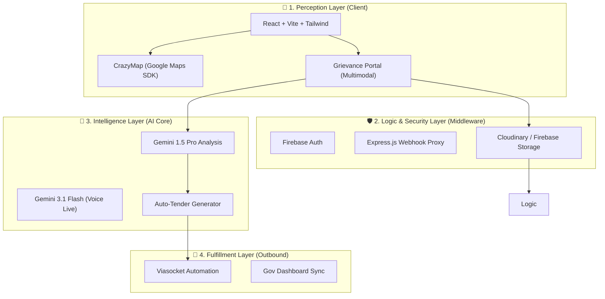

# 🏗️ Infra.AI: Data-Driven Development for Bharat

> **Citizen-Powered Governance for Urban and Rural Landscapes**

Infra.AI is a sophisticated Digital Public Infrastructure (DPI) platform designed to bridge the gap between citizen needs and government response. By combining real-time geospatial intelligence with multimodal AI analysis, we transform raw citizen grievances into actionable civil engineering directives.

---

## 🌌 The Purpose: Why Infra.AI?

In rapidly developing nations, infrastructure deficits often go unnoticed until they become critical. Traditional grievance systems are fragmented, non-visual, and lack the technical depth required for immediate government action.

**Infra.AI exists to:**
- **Empower Citizens:** Provide a simple, multimodal (Photo/Voice/Video) way for anyone, regardless of technical literacy, to report issues.
- **Visualize Hotspots:** Aggregrate local issues into a global heat map to identify infrastructure failure clusters.
- **Automate Intelligence:** Use **Gemini 1.5 Pro** to analyze reports and automatically draft technical tenders, saving months of administrative overhead.

---

## 🧊 3D Architecture Layers

Our architecture is designed as a vertically integrated stack, ensuring data integrity from the moment a citizen snaps a photo to the final government budget allocation.



---

## 🔄 Operational Flow: How it Works

1. **Detection**: A citizen identifies an issue (e.g., a pothole or waterlogging) and uses the **Report Issue** portal.
2. **Multimodal Upload**: The citizen uploads a photo or records a voice note. The app handles immediate background uploads to **Cloudinary** for high-performance media delivery.
3. **AI Processing**: 
   - **Cloudinary** (or Firebase) assigns a secure public URL to the evidence.
   - **Gemini 1.5 Pro** analyzes the transcript and image to determine category, urgency, and recommended civil fix.
4. **Proxy & Deliver**: The **Express backend** proxies the validated payload to an external **Viasocket Webhook**, ensuring reliable delivery to government email systems.
5. **Visualization**: The issue is instantly plotted as a **Hotspot** on the global dashboard, allowing administrators to see clusters of high-risk infrastructure.

---

## 🛠️ Technical Stack

- **Frontend**: React 18, Vite, Tailwind CSS, Motion (Animations), Recharts.
- **Geospatial**: Google Maps Platform SDK, Leaflet (Fallback).
- **Backend**: Node.js, Express.
- **Cloud/AI**: 
  - **Gemini 1.5 Pro**: Deep analysis and document generation.
  - **Cloudinary**: Primary high-performance media storage and optimization.
  - **Firebase**: Authentication & secondary fallback storage.

---

## 📈 Future Scalability

Infra.AI is built with a "Global-Ready, Local-First" philosophy.

1. **Digital Twin Integration**: Moving from 2D maps to 3D Digital Twins of cities using CAD data generated by Gemini.
2. **Blockchain Verification**: Using decentralized ledgers to track "Project Completion" and "Fund Disbursement," preventing corruption.
3. **Predictive Maintenance**: Using historic hotspot data to predict where infrastructure (like sewage pipes) will fail *before* it happens.
4. **IOT Sensor Grid**: Integrating live data from smart city sensors (water level sensors, vibration sensors) directly into the AI analysis engine.

---

## ⚙️ Installation & Setup

1. **Clone the repo**:
   ```bash
   git clone https://github.com/your-username/infra-ai.git
   ```
2. **Install Dependencies**:
   ```bash
   npm install
   ```
3. **Environment Variables**:
   Create a `.env` file and add the following keys:
   ```env
   # Core
   GEMINI_API_KEY="your_google_ai_studio_key"
   COMPLAINT_WEBHOOK_URL="your_viasocket_url"

   # Cloudinary (Optional - Fallback to Firebase Storage if not set)
   VITE_CLOUDINARY_CLOUD_NAME="your_cloud_name"
   VITE_CLOUDINARY_UPLOAD_PRESET="your_unsigned_preset"
   ```
4. **Cloudinary Setup**:
   - Create an **Unsigned** upload preset in Cloudinary.
   - Set the folder to `infra_citizen_reports`.
   - Update your `.env` with the Cloud Name and Preset.

5. **Run Dev Server**:
   ```bash
   npm run dev
   ```

---

## 🏗️ Submission Flow Logic

The application uses an **Immediate Background Upload** strategy:
1. Citizen selects a file (Photo/Video/Audio/Doc).
2. The app immediately pushes the file to **Cloudinary** (or **Firebase Storage** if Cloudinary is unconfigured).
3. The app retrieves the public **Secure Download URL**.
4. On final submission, a clean JSON payload is sent to the `COMPLAINT_WEBHOOK_URL` containing only metadata and the extracted URLs.

---

*Built with ❤️ for a more resilient Bharat.*
